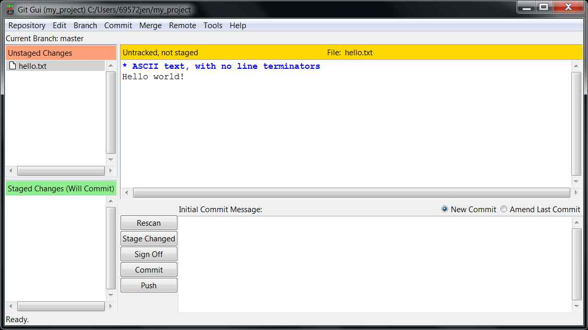

# Introduction to Git - Eramus University Rotterdam

Welcome to the hands-on session for Git during the lunch break of October 31st 2018! During this session all steps included in this document will be followed one by one. After the session, you will be able to replay the actions yourself.

## Requirements

It is assumed that you have a standard @wEURk desktop or laptop of the Erasmus University at your disposal. The screen dumps are made with a standard @wEURk laptop. Of course, it is also possible to use a self-managed laptop. If you are using Windows, the screen dumps will apply to you directly. If you are using macOS, or Linux, you will need to do the transposition yourself.

There are three follow along examples. Firstly, the cloning of a public repository is shown. Then, secondly, the cloned repository is opened and the difference between the last and before last commit are compared. The effect of rolling back is shown. Finally, an own local repository is created which can be shared via, for example, SURFdrive or Dropbox.

For the last two sections, you are more on your own. In these two, the usage of (multiple) tags and (multiple) branches is exemplified with a PhD thesis example and a graphics library, respectively. Check them out, and analyze them with Git GUI and Gitk.

## Installation of Git from the Software Center

1. Open the Software Center application.
2. In the search field, type **Git**. *Please note that the current version is newer than the one shown in the picture.*

   

3. Double click and select Install.

## Cloning an existing repository (from Github.com)

1. Visit the website [http://github.com/jjengelberts/parallelization](http://github.com/jjengelberts/parallelization).
2. Select the ***Clone or download*** button.

   

3. Click the clipboard button to the right of the URL.
4. Right click on a directory (here, Desktop is used).
5. Select ***Git GUI Here***.

   

6. From the main menu, select ***Clone Existing Repository***.

   

7. In the field **Source Location**, paste the URL copied from Github.
8. In the field **Target Directory**, specify a new, non-existing directory name.

   

9. Press the ***Clone*** button.

   

10. After the cloning, the following windows will be shown.

    

11. You can close the Git GUI. You will see the resulting directory on your Desktop.

    

## Open an existing repository (locally) and go back one commit

1. Right click on the **parallelization** folder on your Desktop and select ***Git GUI Here***.

   

2. To check the history, select menu item **Repository/Visualize master's History**

   

3. To go back to version 1.0 of the repository, copy the string **8e145c0f674a2b21ad9cb04186153405d0e7be18**

   

4. Go back to Git GUI and select **Branch/Checkout...**

   

5. Select **Revision Expression** and paste the string **8e145c0f674a2b21ad9cb04186153405d0e7be18**, and press ***Checkout***

   

6. If you now open parallelization.tex, you will notice the typo reintroduced: "Theoritical", rather than "Theoretical".

## Create a new (local) repository

1. In Windows Explorer, create a directory **my_project**, and open it.

2. Right click inside it and select ***Git GUI Here***.

3. From the main menu, select ***Create New Repository***.

4. Click ***Browse***.

5. Click ***Select Folder***.

6. Click ***Create***.

7. Go back to Windows Explorer, and create the file **hello.txt** inside the folder **my_project**.

8. Open **hello.txt** by double clicking, and add some text to the file.

9. Go back to Git GUI and press F5 or click ***Rescan***.

   

10. Now, stage your new file **hello.txt** to be committed with either Ctrl-T or **Commit/Stage to Commit**/

    

11. Insert a remark into the "Initial Commit Message" Field and press ***Commit***.

12. Check your commit by selecting **Repository/Visualize master's History**.

## Using tags

1. Clone (you know now how) my PhD thesis. **Hint**: it can be found on [https://github.com/jjengelberts/proefschrift](https://github.com/jjengelberts/proefschrift).

2. Tags (in Git) are translated into Releases on Github.

3. Check with the Git GUI how you can checkout the version I sent to the PhD reading committee.

   

## Using branches

1. Clone (you know now how) the libpng library. **Hint**: it can be found on [https://sourceforge.net/p/libpng/code/ci/master/tree/](https://sourceforge.net/p/libpng/code/ci/master/tree/).

2. Check with the Git GUI how you can checkout version libpng12 that I needed to use STATA on my Linux machine.

   

Tags are used for fixed, static versions. Branches are used for dynamic versions. For example, libpng12 might still get bug fixes and security updates, although its functionality will no longer be expanded nor modified.
